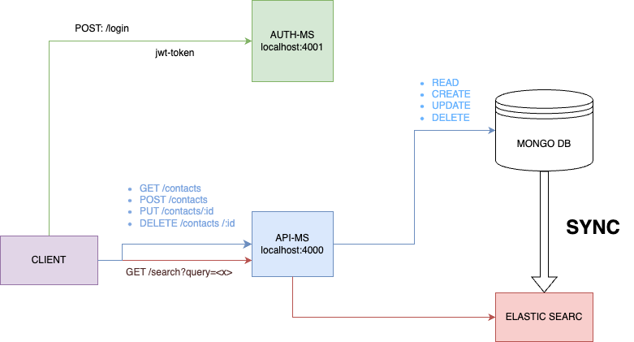

# Phone Contacts Application Documentation

This application by means of classic CRUD operations to manage a telephone directory (Surname, Name, phone number, address, geodata lat/lon, other info). The search on this entity shall be full text for the alphanumeric fields and exact match for the telephone number.



## Microservices

- **Auth Microservice:**
  It manages authentication so that the user's private area can be accessed. It returns a jwt-token
  An example user has been created:
  email: jhon.doe@gmail.com
  password: test

- **Api Microservice:**
  This microservice handles the frontend calls, enabling classic CRUD operations on the contact model. Every CRUD operation syncronize data between MongoDB and ElasticSearch

## Technologies Used

- **Frontend:** React.js with Typescript
- **Backend:** Node.js, Express.js
- **Database:** MongoDB with Mongoose ODM
- **Search:** ElasticSearch

## Prerequisites

- Node.js installed
- MongoDB server running
- ElasticSearch server running

## Start ElasticSearch

```
docker-compose -f ./elastic_conf.yml up
```

## Start Auth microservices

cd ./auth
npm i
npm run start

## Start Contacts microservices

cd ./post
npm i
npm run start

## Start frontend

cd ./client
npm i
npm run start
